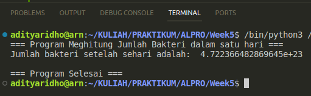

<!-- Judul -->
# Assignment 1

Group Members
 * Debora Intania Subekti (10231029) (2)
 * Aditya Ridho Nugroho (11231003) (6)
 * Naomi Ratna Marisha Guen (11231069) (4)
 * Erzha Nafilah Rosady (16231020) (3)
 * Sofia Dawani Silaban (16231055) (1)
 * Nurjanah Oktafia (20231057) (5)

<!-- Problem 1 start -->
## Problem 1

Diberikan sebuah keluaran sebagai berikut:

 <br>

Menggunakan perintah **print()** dalam Python, tuliskan program Python untuk mencetak tulisan ITK di atas. <br>

### Answer

Untuk memunculkan keluaran seperti permasalahan diatas, dapat dituliskan kode seperti dibawah:
```py
print ("===== ===== =   =")
print ("  =     =   =  =" )
print ("  =     =   = ="  )
print ("  =     =   =  =" )
print ("=====   =   =   =")
```
Yang akan menghasilkan output :

<br>


<!-- Problem 1 end -->

<!-- Problem 2 start -->
## Problem 2

Diberikan suatu bilangan bulat n, buatlah flowchart untuk perintah berikut

* Jika n adalah bilangan ganjil, cetak Aneh
* Jika n adalah bilangan bulat yang berada di rentang dari 2 sampai 5, cetak Tidak Aneh
* Jika n adalah bilangan bulat yang berada di rentang dari 6 sampai 20, cetak Aneh
* Jika n adalah bilangan bulat dan lebih besar dari 20, cetak Tidak Aneh.

### Answer

Flowchart untuk perintah diatas adalah:


<!-- Problem 2 end -->

<!-- Problem 3 start-->
## Problem 3 

Diberikan permasalahan ketika user memberikan dua masukan angka, sebut sebagai variabel a dan b maka akan tercetak 3 baris tambahan sebagai berikut :

1. Baris pertama merupakan jumlahan dari dua angka tersebut
2. Baris kedua merupakan selisih dua angka tersebut (angka masukan pertama dikurangi angka masukan kedua)
3. Baris ketiga merupakan hasil kali dari angka tersebut.

### Answer

Untuk menyelesaikan permasalahan diatas, kode yang dibutuhkan adalah :

```py
a = int(input("Masukkan angka pertama: "))
b = int(input("Masukkan angka kedua: "))
    
jumlah     = a+b
selisih    = a-b
hasil_kali = a*b
    
print("jumlah dari a + b adalah: ", jumlah)
print("jumlah dari a - b adalah: ", selisih)
print("hasil kali a dengan b adalah: ",hasil_kali)


```

Dengan hasil _Test case_ dibawah:

<br>

<!-- Problem 3 end -->

<!-- Problem 4 start -->
## Problem 4

Bakteri Bacillus cereus membelah diri rata-rata setiap 20 menit sekali. Jika di awal suatu cawan petri terdapat 100 bakteri Bacilus cerues, ada berapa bakteri setelah satu hari?
Jawablah pertanyaan tersebut dengan membuat program Python. Gunakan variabel **jumlah_bakteri** dan variabel **waktu**.

### Answer

Dengan Variabel **jumlah_bakteri** dan **waktu** maka kode yang dibutuhkan untuk menyelesaikan permasalahan 4 adalah :

```py
print("=== Program Meghitung Jumlah Bakteri dalam satu hari ===")

jumlah_bakteri   = 100
waktu            = 1440 #(1hari = 24jam = 1440menit)
waktu_pembelahan = 20 #satuan dalam menit

#rumus menghitung jumlah bakteri 
total_bakteri  = jumlah_bakteri * (2 ** (waktu / waktu_pembelahan))

print("Jumlah bakteri setelah sehari adalah: ",total_bakteri)

print("\n=== Program Selesai ===")

```
Yang menghasilkan output dibawah ini :




<!-- Problem 4 end -->

<!-- Problem 5 start -->
## Problem 5

Masih mengacu pada Problem (4). Jika bakteri Bacillus cereus meninggal setelah hidup satu hari. Ada berapa bakteri yang masih hidup setelah 500 jam?

Jawablah pertanyaan tersebut dengan membuat program Python. Gunakan variabel **jumlah_bakteri_hidup**, variabel **jumlah_bakteri_meninggal** dan variabel **waktu**.

Untuk menjawab pertanyaan tersebut dengan membuat program Python. Menggunakan Gunakan variabel **jumlah_bakteri_hidup**, variabel **jumlah_bakteri_meninggal** dan variabel **waktu**. :

```py
jumlah_bakteri_hidup     = 0
jumlah_bakteri_meninggal = 0
waktu                    = 500 #jam

#Menghitung jumlah bakteri hidup setelah 500jam
if waktu >= 24:
    jumlah_bakteri_hidup     = 2 ** (waktu // 24)
    jumlah_bakteri_meninggal = 2 ** (waktu // 24) - 1

#Mencetak total bakteri yang hidup dan meninggal
print("Jumlah Bakteri yang Masih Hidup adalah: ", jumlah_bakteri_hidup)
print("Jumlah Bakteri yang Sudah Meninggal adalah: ", jumlah_bakteri_meninggal)

```

Yang menghasilkan Output :


<!-- Problem 5 end -->

<!-- Problem 6 start -->
 
## Problem 6
Satu hari akan ditambahkan pada kalender hampir tiap empat tahun sekali yaitu pada tanggal 29 Februari, hari tersebut disebut hari kabisat. Hari kabisat tersebut ditambahkan dengan tujuan karena dalam satu tahun planet bumi mengelilingi matahari tidak tepat bilangan bulat, namun 365.25 hari. Suatu tahun yang memuat hari kabisat disebut tahun kabisat.

Di dalam kalender Masehi (kalender yang umum digunakan di seluruh dunia), ada tiga kondisi untuk mengidentifikasikan suatu tahun adalah tahun kabisat

* Jika suatu tahun habis dibagi 4 maka tahun tersebut adalah tahun kabisat jika TIDAK habis dibagi 100.
* Jika habis dibagi 100 maka tahun tersebut adalah tahun kabisat jika habis juga dibagi 400.
* Jika tidak habis dibagi 400, maka tersebut BUKAN tahun kabisat.

Buatlah flowchart dari program penentuan suatu tahun apakah tahun kabisat atau bukan. Ujilah program dengan tahun-tahun berikut: 2024, 2023, 2000, 1900.

### Answer

Flowchart untuk tahun 2024 adalah dibawah ini :

<br>

Sedangkan untuk flowchart tahun 2023 yaitu :

<br>

Selanjutnya untuk flowchart tahun 2000 yaitu :

<br>

Dan yang terakhir untuk flowchart tahun 1900 :


<!-- Problem 6 end -->
